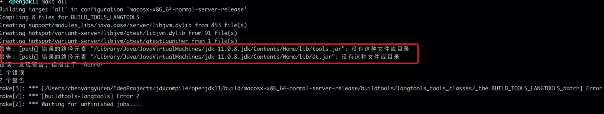

# openjdk11
jdk11源码学习记录

## openjdk11环境搭建(Mac版)
搭建方法学自B站上羊哥的视频，视频链接如下：
https://b23.tv/uKPRTS
虽然按照上述视频教程进行了环境搭建JDK11，但是还是遇到了不少坑，在此记录一下。
安装前需要准备的jdk8和jdk11，我已上传网盘：
链接: https://pan.baidu.com/s/1gOCDpastOcHMpTUoz-No0A  密码:uzq0 
mac兼容两个版本的jdk的配置方法：
https://blog.csdn.net/qq_42214137/article/details/93223637
准备工作
视频里是用的mac，但是实际情况下也可以用linux系统，比如Ubuntu等，尽量保证与视频里的环境一致。
- 准备包管理工具（如果本地有相关环境，此步骤可忽略）
- mac环境下建议安装brew包管理工具，建议使用4G网络进行安装，不然特别慢。具体安装教程入下：
https://www.cnblogs.com/x1you/p/12506405.html
- 如果是linux环境，包管理工具ubuntu可以使用apg-get，centos可使用yum工具等。
- 终端工具建议mac使用iterm（此步骤可忽略，与本次jdk源码搭建无关），具体安装教程如下：
https://www.jianshu.com/p/ba08713c2b19
版本信息：
```
// 版本信息
masOS: 10.15.5
java: 11.0.8 (视频里是11.0.7)
Xcode: 11.6
clang: 11.0.3 (clang --version) // c
clang++: 11.0.3 (clang++ --version) // c++
autoconf: 2.69 // 自动配置
make: 3.81 (make --version) // make编译器
freetype: 2.7.0 (freetype-config --ftversion) // freetype渲染库
```
- 安装完xcode环境之后，发现没有autoconf，于是需要安装autoconf 2.69
  > https://blog.csdn.net/andyguan01_2/article/details/89385120
- 然后执行视频中的自动配置，果然没有预想的那么顺利，报错了
  报错如下：`configure: error: No xcodebuild tool and no system framework headers found, use --with-sysroot or --with-sdk-name to provide a path to a valid SDK`
  最后找到了一个解决方案，执行`sudo xcode-select --switch /Applications/Xcode.app/Contents/Developer`关联xcode即可。
  > 博文地址：https://segmentfault.com/a/1190000020736814
- 然后执行视频中的make all命令，发现报错，报错信息如下
  
  表示没有tools.jar和dt.jar，这就很尴尬了，于是我去看jdk11的包，里面确实没有上面两个jar。
  经过问度娘，发现jdk9以后发生了一些变化，没有了这两个jar包。
  按照网上的方法，是需要将jdk8中的这两个jar复制到jdk11里面，于是需要安装jdk8，我复制完之后，执行了make all，果然OK。
  > 博文地址：https://blog.csdn.net/wd2014610/article/details/81636417                                                                                                                                                                                                                                                            
                                                                                                                                                                                                                                                                      